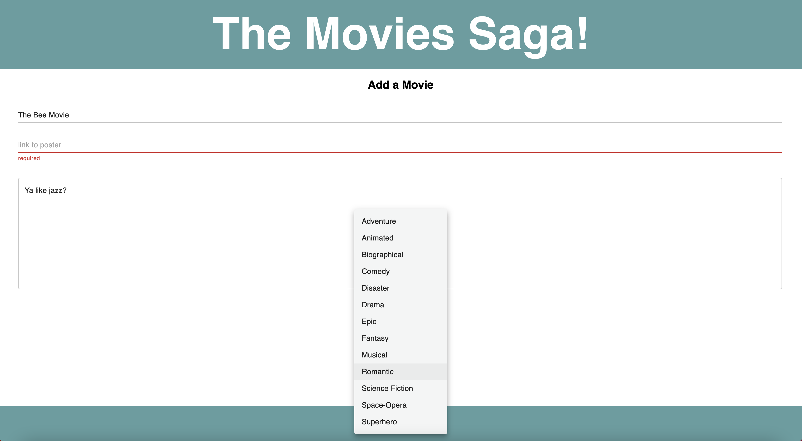

# Movie Sagas

## Description
*Duration: Weekend assignment*

This weekend assignment required us to create a full-stack movie database using Redux-Saga. The server-side database was pre-structured to include two tables for entered movies and existing associated genres, and a third "movies_genres" table joining the two in a many-to-many relationship. Apart from the requirement of creating a details page for each movie entry using route parameters, the rest of the app's functionality was up to us. I followed the stretch-goal recommendations of creating a form page to add movie entries, and the ability to edit existing entries from the details page. 

Images of all pages can be viewed below, and full assignment details can be found in [`INSTRUCTIONS.md`](INSTRUCTIONS.md)

## Final Product Snapshots

    Homepage

    Movie Details

    Add you own!

### Prerequisites
    • Node.js

## Installation and Setup

Visit the fully deployed app [here](https://gentle-savannah-70307.herokuapp.com/)

Or, run it locally:

1. Clone this repository from Github
2. Create a database titled "saga_movies_weekend" and the necessary tables using the initializer found in `database.sql`
3. Run `npm install` in your terminal to download the necessary modules
4. Run `npm run client` to start React
5. In a separate terminal, run `npm run server` to start the server
6. Visit http://localhost:3000 in your browser to view the project!

## Usage

From the home page, click on a movie's poster to view its details, or click the 'add a movie' button to submit your own movie entry. 

From each movie's details page, you can edit the details or delete the entry entirely. On the form page, enter a title, poster link, description, and select your movie's genres to send it to the database. 

## Built With

* React
* Redux-Saga
* JavaScript
* PostgreSQL
* HTML
* CSS
* Material UI
* Express 
* Axios
* Node-Postgres

## Acknowledgement

Special thanks to [Prime Digital Academy!](https://github.com/PrimeAcademy) 
